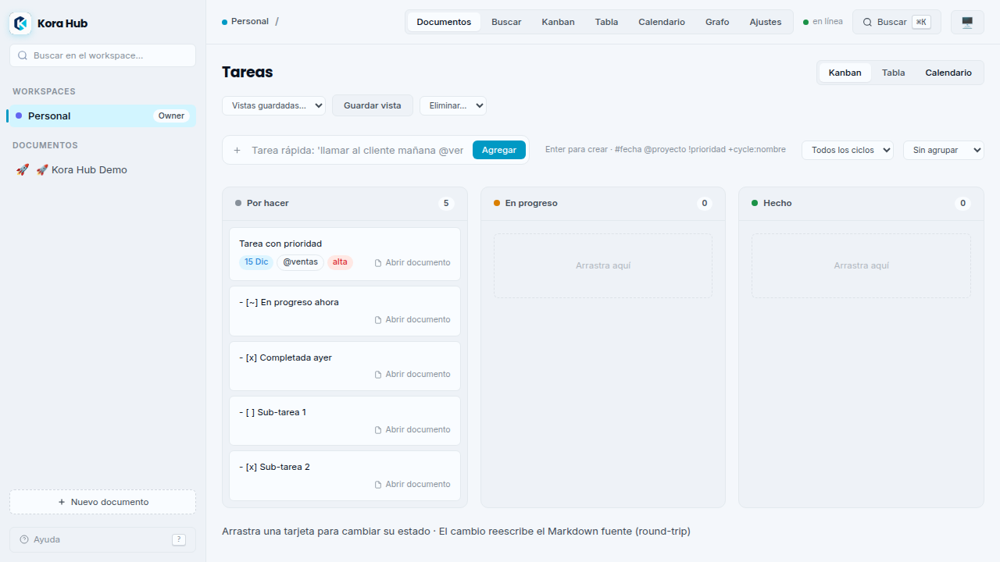
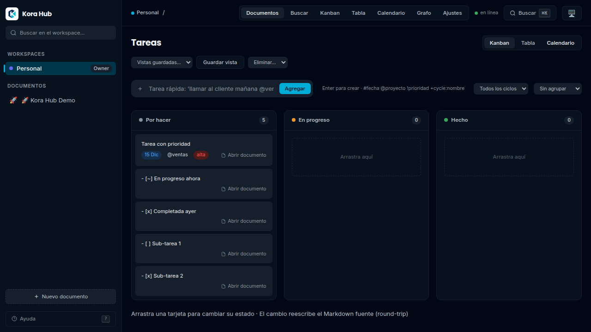
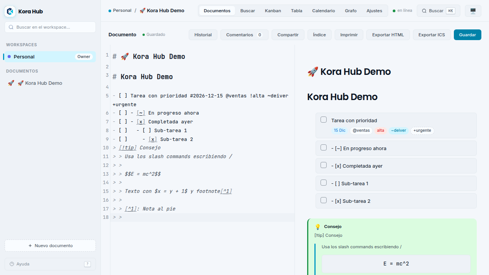
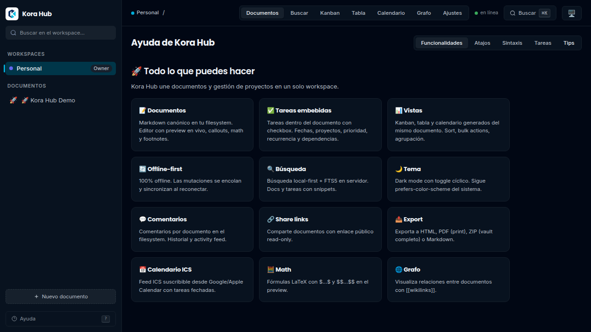
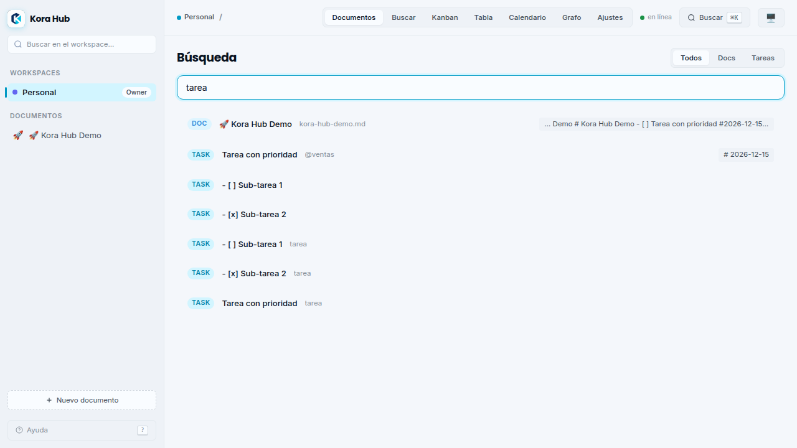
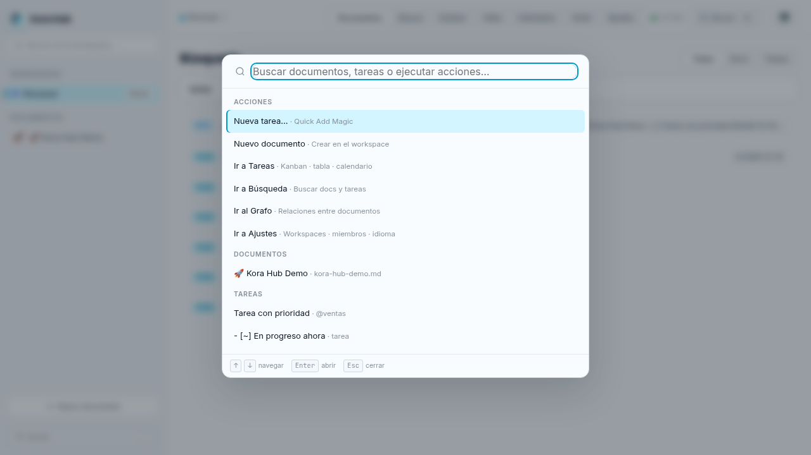

<div align="center">

# Kora Hub

**Your docs and your tasks in one place — self-hosted, offline-first, and fast like a native app.**

Write in Markdown. Keep your tasks *inside* your documents. Kora Hub turns them into a kanban, a table, and a calendar automatically — because **the files are the source of truth, and everything else is just a lens on the same data**.

[](LICENSE)
[](https://go.dev)
[](https://elur.dev)
[](https://github.com/DeijoseDevelop/Kora-Hub/actions)

[Website](https://zekrost.dev) · [Architecture](docs/ARCHITECTURE.md) · [Report a bug](https://github.com/DeijoseDevelop/Kora-Hub/issues)

</div>

---

<p align="center">
  
</p>

## What is it?

A single, lightweight binary that replaces the usual pile of tools — a wiki here, a kanban there, a drive somewhere else. No accounts on someone else's cloud. No five containers to maintain.

```markdown
# Feature: live tracking

- [ ] Design the task parser data model #2026-08-20 @deijose !alta ~deiver
- [x] Implement embedded task parsing #2026-08-14 @deijose !alta
```

That file *is* your project board. Complete a task in the kanban and it marks the checkbox in the document — same entity, two views.

## Features

**📄 Documents**
- Markdown editor with live preview (CodeMirror 6) — callouts, LaTeX math, footnotes
- Slash commands (`/` to insert headings, tasks, tables, embeds)
- Table of Contents (auto-generated from headings)
- `[[Wiki-links]]`, backlinks and a relationship graph
- Drag-and-drop attachments (local disk or S3-compatible)
- Version history with visual diff; losing version is always preserved
- Templates: proposal, meeting notes, RFC, retrospective
- **Export**: HTML (self-contained), PDF (print), ICS (calendar feed)

**✅ Embedded tasks**
- Natural-language metadata: `#due-date @project !priority ~assignee +tag`
- Recurrence (`*every:1w`) and dependencies (`^blocked-by:`)
- **Sub-tasks** via indentation — nested cards with progress bars
- **Cycles/sprints** (`+cycle:name`) with progress tracking
- **Kanban, table and calendar views** — sort, bulk actions, grouping, inline edit
- **Quick Add Magic**: press `⌘K`, type `call client #tomorrow @sales !high`, done
- Round-trip guaranteed: editing from any view rewrites the source line *byte for byte*

**💡 Editor enhancements**
- **Callouts** (`> [!note]`, `> [!tip]`, `> [!warning]`, `> [!danger]`, `> [!info]`…)
- **LaTeX math**: `$inline$` and `$$block$$` formulas
- **Footnotes** (`[^1]`) with auto-generated notes section
- **Embeds**: YouTube, Vimeo, Spotify, audio/video (whitelisted domains)
- **Dark mode** with toggle (follows `prefers-color-scheme`)

**⚡ Navigation**
- **Command palette** (`⌘K`) — actions, docs, tasks, fuzzy search
- **Quick switcher** (`⌘P`) — jump to any document instantly
- **Keyboard shortcuts** (`g+d/t/s/g/k` for navigation, `?` for help)
- **Built-in help** (`?`) — features, shortcuts, syntax, tips

**💬 Collaboration**
- **Comments** per document (stored in filesystem)
- **Activity feed** — recent changes across the workspace
- **Share links** — public read-only documents
- **Page icons** — emoji in title becomes sidebar icon

**⚙️ Platform**
- **Offline-first by design**: local command queue with replay, delta sync on reconnect
- **One binary**: Go + SQLite + embedded frontend. One container, one volume — `<100 MB RAM`
- **API-first**: everything the UI can do, the REST API can do
- **MCP server** (`POST /api/v1/mcp`) — same actions as UI for AI agents
- Full-text search (FTS5) with local + server results
- Workspaces with roles (owner / editor / viewer)
- **Import**: Obsidian vaults, Notion exports (ZIP)
- **PWA** installable; native iOS/Android via Capacitor; desktop via Tauri

## Quickstart

**Docker — one command:**

```bash
docker run -d \
  -v hub-data:/data \
  -p 8080:8080 \
  -e HUB_JWT_SECRET=<your-secret> \
  ghcr.io/deijosedevelop/kora-hub:latest
```

Open [http://localhost:8080](http://localhost:8080).

| Environment variable | Required | Description |
|:--|:--:|:--|
| `HUB_JWT_SECRET` | ✅ | Secret used to sign JWT tokens |
| `HUB_BIND` | | Listen address (default `:8080`) |
| `HUB_DB_PATH` | | SQLite index path (default `data/hub.db`) |
| `HUB_DATA_DIR` | | Canonical documents directory (default `data`) |
| `HUB_STORAGE` | | `local` or `s3` (Cloudflare R2 / MinIO / AWS) |

**Backup** = stop → copy `data/` → done. One directory is everything.

## Screenshots

<p align="center">
  
  
  <br />
  
  
  <br />
  
  
</p>

## Desktop app

Kora Hub también se distribuye como **aplicación de escritorio nativa** (Tauri 2): un shell de ~3 MB que embebe el binario Go como *sidecar* y lo ejecuta en `127.0.0.1` con tus datos en tu carpeta local — 100% offline.

Instalables por plataforma (GitHub Releases):

| Plataforma | Instalable |
|:--|:--|
| Linux | `.deb` y `.AppImage` (x86_64) |
| Windows | `.msi` e instalador `.exe` (NSIS) |
| macOS | `.dmg` (Intel y Apple Silicon) |

> Sin firma por ahora: Windows SmartScreen y macOS Gatekeeper mostrarán una advertencia en la primera ejecución (habitual en open source). Datos en `~/.local/share/dev.kora.hub/` (Linux), `~/Library/Application Support/dev.kora.hub/` (macOS) o `%APPDATA%\dev.kora.hub\` (Windows).

### Desarrollo local de la app de escritorio

Prerequisitos (una vez): [Rust](https://rustup.rs) y las dependencias de sistema de Tauri — en Debian/Ubuntu/Mint:

```bash
sudo apt install libwebkit2gtk-4.1-dev build-essential curl wget file libxdo-dev libssl-dev libayatana-appindicator3-dev librsvg2-dev
```

```bash
make desktop-dev     # compila el sidecar y lanza la app con hot reload
make desktop-build   # genera los instalables en desktop/src-tauri/target/release/bundle/
```

## Development

Requirements: [Go 1.26+](https://go.dev/dl), [Node.js 22+](https://nodejs.org), [sqlc](https://sqlc.dev) v1.31.

```bash
git clone git@github.com:DeijoseDevelop/Kora-Hub.git
cd Kora-Hub

make frontend   # build the Elur frontend and embed it
make generate   # regenerate sqlc code
make dev        # Go backend on :8080
```

In another terminal:

```bash
cd web
npm run dev     # Vite dev server on :5173 (proxies /api → :8080)
```

| Command | What it does |
|:--|:--|
| `make build` | Single binary with embedded frontend |
| `make test` | Backend tests (Go) |
| `make vet` | `go vet` + TypeScript typecheck |
| `make docker` | Multi-stage Docker image |

## Architecture

```
┌───────────────────────────────────────────────┐
│ CLIENT — one codebase                         │
│ Elur SPA → PWA (browser) | Capacitor (apps)   │
│ Offline queue (IndexedDB) + delta sync         │
└──────────────────────────┬────────────────────┘
                           │ HTTPS / REST (JSON)
┌──────────────────────────▼────────────────────┐
│ GO BINARY — one process                       │
│ Gin · JWT · task parser · FTS5 · MCP           │
│ ├─ SQLite (modernc) — index & cache            │
│ ├─ Markdown store — canonical files            │
│ └─ Attachments — S3 interface (local/R2/MinIO) │
└───────────────────────────────────────────────┘
```

**Core principles** (from the [technical architecture](docs/ARCHITECTURE.md)):
1. Files are the truth; the database is a rebuildable index.
2. Offline-first from birth; no feature assumes connectivity.
3. One artifact; if it needs five services to start, it has already failed.
4. API-first: the UI is just another client.
5. Budget: <100 MB RAM per instance, <10 s cold start.

**Stack:** Go 1.26 · Gin v1.12 · sqlc v1.31 · SQLite (FTS5) · Elur 4.x · CodeMirror 6 · Capacitor 8 · Tauri 2 · GitHub Actions + GoReleaser

## API

Everything the UI does, the API does. Bearer-token auth with rotating
refresh tokens (silent renewal — you only log in every 30 days or on
first run). Registering creates your "Personal" workspace automatically.

```bash
# Register & login
curl -X POST localhost:8080/api/v1/auth/register \
  -H 'Content-Type: application/json' \
  -d '{"email":"you@example.com","password":"min8chars","display_name":"You"}'

# Quick Add Magic
curl -X POST localhost:8080/api/v1/tasks \
  -H "Authorization: Bearer $TOKEN" -H 'Content-Type: application/json' \
  -d '{"text":"review invoices #tomorrow @deijose !high"}'

# Views are projections of the index
curl "localhost:8080/api/v1/tasks?vista=calendar&desde=2026-09-01&hasta=2026-09-30" \
  -H "Authorization: Bearer $TOKEN"

# Offline sync (delta by cursor)
curl "localhost:8080/api/v1/sync/changes?since=0" -H "Authorization: Bearer $TOKEN"
```

Full endpoint reference is in [docs/ARCHITECTURE.md](docs/ARCHITECTURE.md).

## Contributing

Issues, ideas and pull requests are welcome. We dogfood the product — Deijose and BikerOS are managed with Kora Hub.

Before submitting a PR, please open an issue or comment on an existing one so the approach is agreed on before code is written.

## License

**AGPL-3.0-only** — see [LICENSE](LICENSE) and [NOTICE](NOTICE).

The self-hosted product is free and complete. Paid offerings (encrypted sync service, hosted cloud, team plans) are convenience services that never restrict what runs on your own server. Anyone who hosts the product must open their code.

---

<p align="center">Built by <a href="https://github.com/DeijoseDevelop">Deijose</a> — dogfooding our own product since day one.</p>
